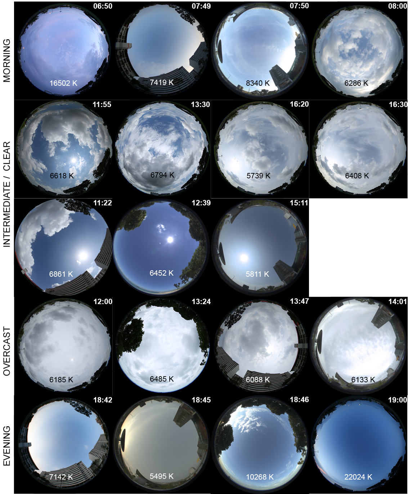

# Spectral data for equatorial skies
Spectral data of Singapore skies

## Terms of use
For use of the dataset in research, kindly cite my PhD dissertation *Measuring and Modelling Equatorial Light*

```
@phdthesis{balakrishnan2019,
    author  = "Balakrishnan, Priji",
    title   = "Measuring and Modelling Equatorial Light",
    school  = "Singapore University of Technology and Design",
    year    = "2019",
    address = "8 Somapah Rd, Singapore 487372",
    month   = "jan"
}
```

## Methodology
The dataset contains 44 measurements of equatorial skies taken in the East of Singapore at four sites of urban and non-industrial nature. The measurements were taken using a Konica Minolta CL-500A illuminance spectrophotometer and include the global spectral irradiance in W/m<sup>2</sup>/nm falling on a horizontal surface from the sun (when present) and the sky at a 1nm pitch from 360nm to 780nm, the sky dome’s Correlated Colour Temperature (CCT) in Kelvin (K), and global illuminance in Lux (lux).

## How to use

### Metadata

[metadata.csv](metadata.csv) contains the list of available observation, in CSV format with columns `MonthYear,Time,SkyType,CCT,GlobalIllum,GlobalIrrad`.

- `MonthYear` is in format `DDMMYY`.
- `Time` is in format `HH:MM` UTC+8.
- `SkyType` takes values
    - `CS` for clear sky
    - `IS` for intermediate sky
    - `OS` for overcast sky
    - `MS` for morning sky (6:45 am to 8:45 am)
    - `ES` for evening sky (6:00 pm to 7:30 pm)
    - `MSOS` for morning overcast sky
    - `MSIS` for morning intermediate sky
    - `ESCS` for evening clear sky.
- `CCT` is Correlated Colour Temperature, in Kelvins (K).
- `GlobalIllum` is the global horizontal illuminance measured in Lux.
- `GlobalIrrad` is the global horizontal irradiance measured in W/m<sup>2</sup> from a weather station located at Singapore University of Technology and Design, east of Singapore.

### Spectral irradiance

The [datasets](datasets/) folder contains the measurements, with one file per available measurement. The filename reflects the measurement metadata, with format `<MonthYear>-<Time>-<SkyType>-<CCT>K.csv`.

The columns in each file are `wv,spd`.
- `wv` is for wavelength measured from 360 nm to 780 nm at every 1-nm pitch.
- `spd` is the spectral irradiance measured in W/m<sup>2</sup>/nm


Images of Singapore skies presented in this dataset.
